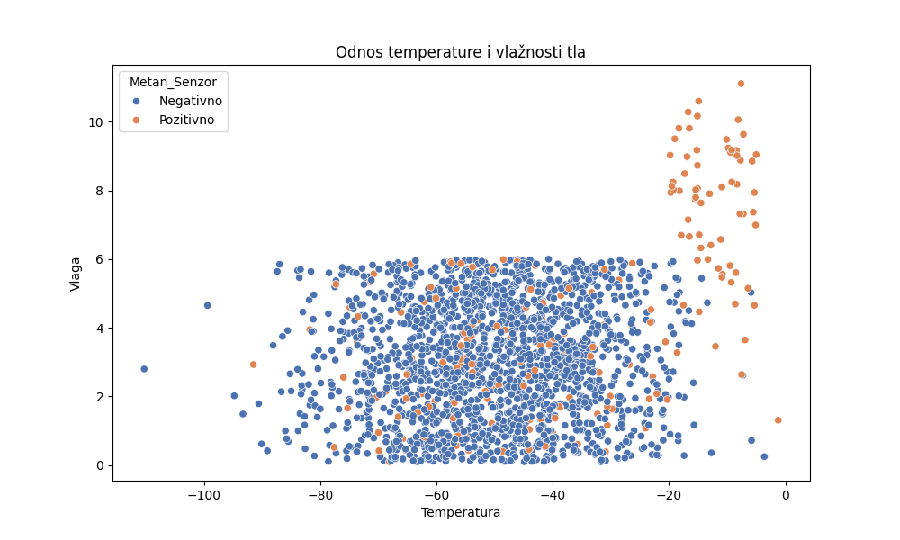
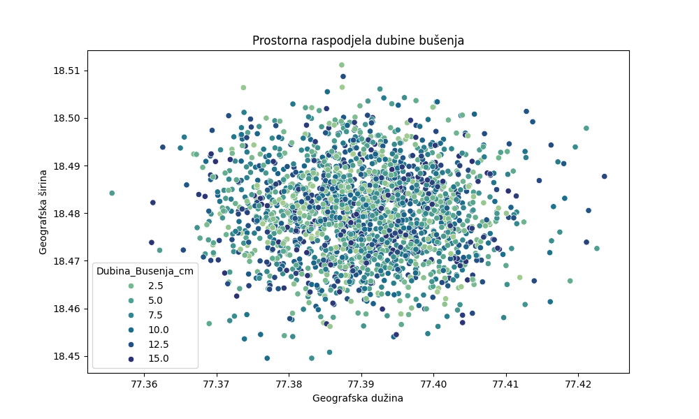
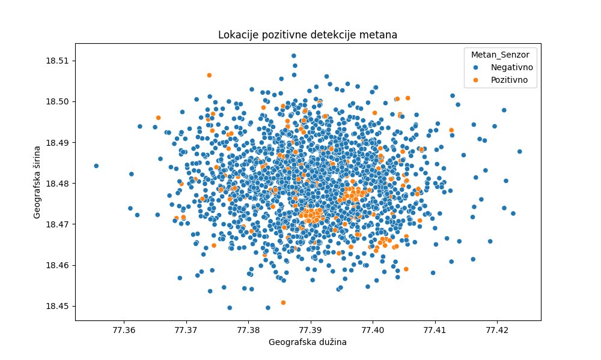
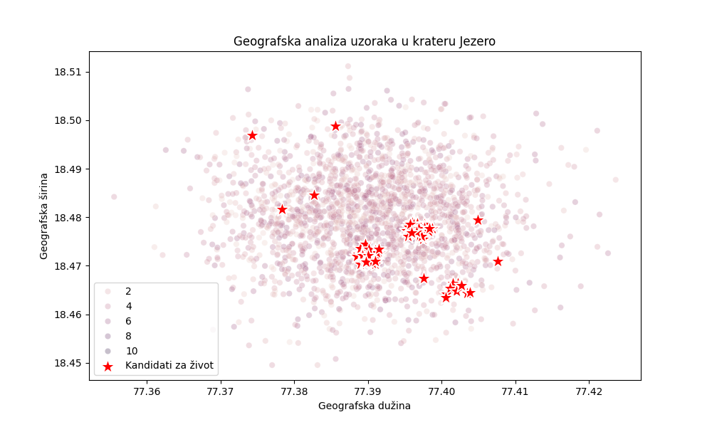
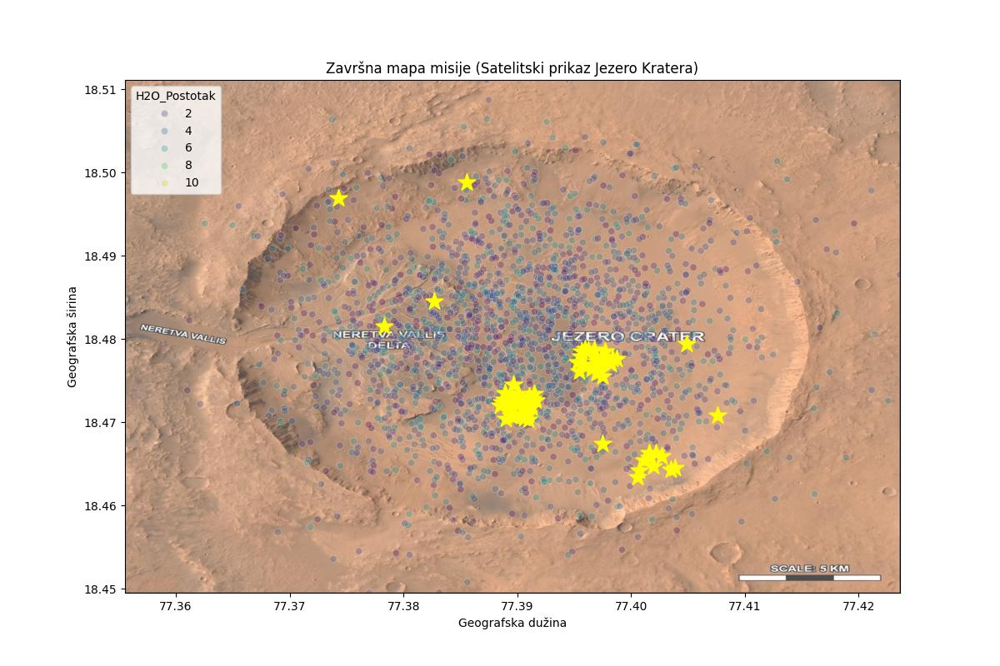

**Simulacija stvarnih podataka: Vizualizacija i uplink**

---

## A. Izvršni sažetak (Executive Summary)

* **Analitički pipeline za obradu geoprostornih i kemijskih podataka prikupljenih unutar kratera Jezero na Marsu. Program identificira znanstveno relevantne lokacije s potencijalnim indikatorima biološke aktivnosti te generira navigacijske naloge za autonomni istraživački sustav. Program učitava dvije relacijske CSV tablice s podacima o lokacijama uzorkovanja i senzorskim očitanjima, spaja ih, filtrira anomalije te generira strukturirani JSON navigacijski nalog za robota-istraživača.**

* **Ključne funkcionalnosti:**

* * Učitavanje i spajanje relacijskih CSV podataka
* * Validacija i filtriranje senzorskih anomalija
* * Geoprostorna vizualizacija (5 grafova)
* * Generiranje JSON navigacijskog naloga (_nexus.json_)

---

## B. Metodologija obrade podataka (Data Wrangling)

* **Iz mape _moji_mars_podaci_ učitavamo CSV datoteke _mars_lokacije.csv_ i _mars_uzorci.csv_. Obje datoteke koriste ";" kao separator i "," kao decimalni znak.**

_df_lokacije = pd.read_csv("moji_mars_podaci/mars_lokacije.csv", sep=";", decimal=",")_

_df_uzorci   = pd.read_csv("moji_mars_podaci/mars_uzorci.csv",   sep=";", decimal=",")_

* **Datoteke se zatim spajaju po ključu _ID_Uzorka_.**

_df_spojeno = pd.merge(df_lokacije, df_uzorci, on="ID_Uzorka")_

* **Podaci se zatim filtriraju pomoću varijable _df_filtrirano_ i anomalije se zapisuju u varijablu _df_anomalije_.**

_df_filtrirano = df_spojeno[df_spojeno["Temp_Tla_C"] < 150]_

_df_anomalije  = df_spojeno[df_spojeno["Temp_Tla_C"] > 149]_

* **Podaci se filtriraju kako bi se izbjegli podaci sa greškama koji bi mogli kvariti podatke u daljnjem dijelu programa.**
---

## C. Geoprostorna analiza i vizualizacija

**1. Odnos temperature i vlažnosti tla**
   
   

* **Graf prikazuje odnos između temperature i vlažnosti tla, uz dodatnu dimenziju prisutnosti metana (hue).**

* **Može se uočiti da je metan prisutan na lokacijama sa niskom temperaturom i visokom količinom vlage**

**2. Prostorna raspodjela dubine bušenja**
   
   

* **Graf prikazuje koordinate svih lokacija bušenja te koliko se duboko bušilo.**

* **Može se uočiti da se većinom buši dublje u određenim zonama**

**3. Lokacije pozitivne detekcije metana**
   
   
   
* **Graf prikazuje pozitivne i negativne metanske signale**

* **Može se uočiti da su metanski signali raspoređeni po zonama**

**4. Geografska analiza uzoraka u krateru Jezero**
   
   
   
* ****

**5. Završna mapa misije (Satelitski prikaz Jezero Kratera)**
   
   
   
   Podaci su projicirani na satelitsku sliku korištenjem parametra "extent", koji definira granice prikaza slike u koordinatnom sustavu podataka:

[min_long, max_long, min_lat, max_lat]

Tehnički značaj:
Extent mapiranje omogućuje transformaciju piksel koordinata slike u realne GPS koordinate. Time se postiže precizno preklapanje analitičkih rezultata s vizualnim kontekstom terena, što je ključno za navigaciju autonomnih sustava.

---

## D. Komunikacijski protokol (JSON Uplink)

* **Kraj programa stvara JSON objekt koji koristimo za izvoz. Objekt sadrži listu kandidata za istraživanje, indetifikatore uzorka, geopoziciju i akcije koje robot treba izvršiti.**

* **Podaci su generirani pomoću petlje kroz filtrirani DataFrame. Njome se omogućuje dinamičko skaliranje sustava čime izbjegavamo hardkodiranje.**

_for index, red in kandidati.iterrows():_

      _akcija = {_

      _"ID_Uzorka": int(red['ID_Uzorka']),_
   
      _"lokacija": {_
   
      "lat": float(red['GPS_LAT']),
      
      "lon": float(red['GPS_LONG'])
      
      _},_
   
      _"naredbe": [_
   
      {
      
         "tip": "NAVIGACIJA",
         
         "opis": "Robot se kreće do zadane lokacije"
         
      },
      
      {
      
         "tip": "SONDIRANJE",
         
         "dubina_cm": float(red['Dubina_Busenja_cm'])
         
      },
      
      {
      
         "tip": "SLANJE_PODATAKA",
         
         "parametri": {
         
            "temperatura": float(red['Temp_Tla_C']),
            
            "vlaga": float(red['H2O_Postotak']),
            
            "metan": red['Metan_Senzor'],
            
            "organske_molekule": bool(red['Organske_Molekule'])
            
         }
      }
   _]_
_}_

_misija["akcije"].append(akcija)_

---

## E. Inženjerski dnevnik (Troubleshooting Log)

* **Tokom pisanja programa dolazimo do 2 problema koji se tokom programa moraju rješiti**

**1. Neispravno učtavanje CSV datoteke**

* **Problem nastaje zbog korištenja drugačije oznake separatora i decimalne točke u datotekama _mars_lokacije.csv_ i _mars_uzorci.csv_.**
  
* **Problem možemo rješiti definiranjem parametra prilikom učitavanja datoteka.**

_df_lokacije = pd.read_csv("moji_mars_podaci/mars_lokacije.csv", sep=";", decimal=",")_

_df_uzorci   = pd.read_csv("moji_mars_podaci/mars_uzorci.csv",   sep=";", decimal=",")_

**2. Neispravno prikazivanje satelitske slike**

* **Problem nastaje zbog problema s poravnanjem padataka i slike. Program nema pravilno definirane granice.**

* **Problem se može rješiti korištenjem minimalnih i maksimalnih GPS koordinata iz skupa podataka i njihovom primjenom na parametar extent.**

_extent_koordinate = [df_fitrirano['GPS_LONG'].min(), df_fitrirano[+GPS_LONG'].max(), df_filtrirano['GPS_LAT'].min(), df_filtrirano['GPS_LAT'].max()]_

---
